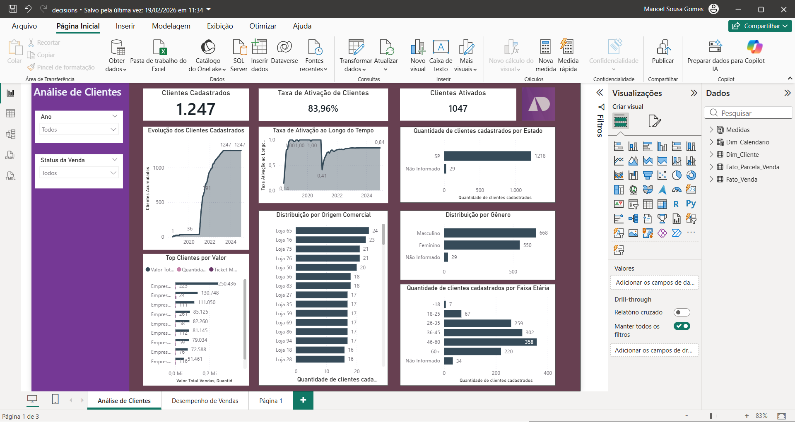
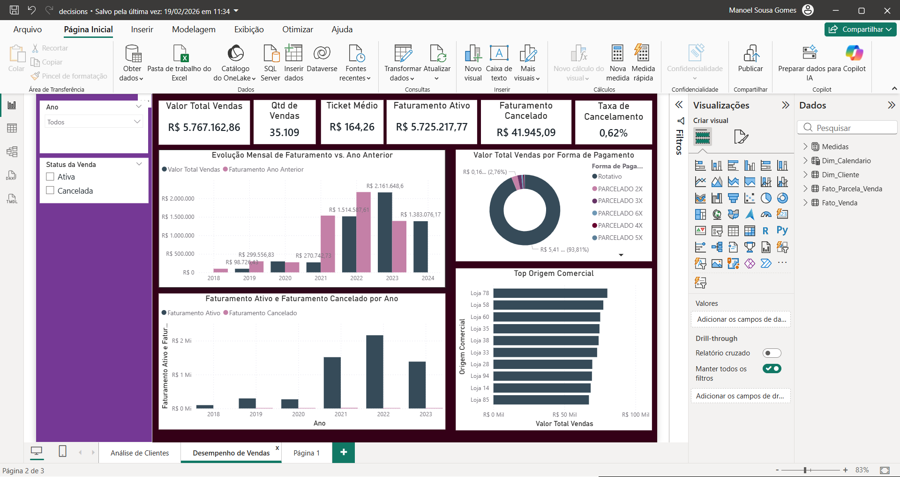

# 📊 Sales & Customer Analysis Dashboard

## 📌 Objective

This project aims to analyze sales and customer data to generate insights that support business decision-making.

---

## 🛠 Tools & Technologies

* Power BI
* SQL (data manipulation)
* Data Modeling (Star Schema)
* ETL (Extract, Transform, Load)

---

## 📊 Dashboards

### 👥 Customer Analysis

### 💰 Sales Performance

---

## 📈 Key Metrics

* Total Sales
* Quantity of Sales
* Average Ticket
* Customer Activation Rate
* Cancellation Rate

---

## 🧠 Business Insights

* Sales growth increased significantly over time, indicating business expansion
* A small number of regions concentrate most of the revenue, suggesting market dependency
* Low cancellation rate (~0.62%) reflects operational efficiency
* Certain products and sales channels outperform others, indicating optimization opportunities

---

## 🗂 Data Model

The project follows a **Star Schema**, consisting of:

* Fact table: Sales
* Dimension tables: Customer, Product, Date

---

## 🚀 Conclusion

This dashboard provides a clear view of business performance, enabling the identification of trends, risks, and growth opportunities through data-driven analysis.

---

## 👨‍💻 Author

Manoel Sousa Gomes

🔗 LinkedIn: https://www.linkedin.com/in/manoel-sousa-712a6b240/
🔗 GitHub: https://github.com/Maelsousa
